# Local ML Pipeline

The goal of this `local/` directory is to eliminate any need of infrastructure and get the whole project running locally.

I (Eric) found myself confounded by two simultaneous learning curves: sagemaker and timeseries forecasting in general.

Running everything locally, and without an orchestrating framework like Airflow, Metaflow, SageMaker, etc. will make the infra part much more straightforward.

## Overview

## Local Folder Structure

```
local/
  scripts/
    00_run_ddl_queries.py - run all ddl__*.sql files
    10_download_taxi_rides_yyyy_mm.py - download monthly yellow taxi parquet files
    11_merge_taxi_rides_into_duckdb.py - merge taxi ride parquet files into raw table
    20_download_taxi_zone_lookup.py - download TLC taxi zone lookup CSV
    21_download_taxi_zone_shapes.py - download TLC taxi zone shapefile ZIP
    22_extract_taxi_zone_centroids_csv.py - extract centroids CSV from shapefile ZIP
    23_merge_taxi_zone_lookup_into_duckdb.py - merge taxi zone lookup CSV into raw table
    24_merge_taxi_zone_centroids_into_duckdb.py - merge centroid rows into staging table
    30_merge_curated_date_dim.py - merge curated.date_dim for a date range
    31_build_taxi_curated_layer.py - build staged and curated taxi tables
  queries/
    ddl__raw__taxi_yellow_tripdata_fact.sql - raw yellow taxi trips table DDL
    merge__raw__taxi_yellow_tripdata_fact.sql - merge raw taxi rides from parquet files
    view__staging__taxi_yellow_tripdata_fact.sql - staging table built from raw rides
    view__curated__taxi_yellow_tripdata_fact.sql - curated taxi rides table
    ddl__raw__taxi_zone_dim.sql - raw taxi zone dimension DDL
    merge__raw__taxi_zone_dim.sql - merge taxi zone lookup CSV into raw dim
    ddl__staging_taxi_zone_centroids.sql - staging centroids dimension DDL
    merge__raw__taxi_zone_centroids_dim.sql - merge computed centroids into staging
    view__curated__taxi_zone_dim.sql - curated taxi zone dimension table
    ddl__curated__date_dim.sql - curated date dimension DDL
    merge__curated__date_dim.sql - merge date dimension for a date range
    ddl__curated__datetime_hour_dim.sql - curated hour dimension DDL
    ddl__raw__weather_daily_fact.sql - raw daily weather fact DDL
    ddl__raw__weather_hourly_fact.sql - raw hourly weather fact DDL
    initial_daily_taxi_rides.sql - daily pickup series per zone for modeling
```

1. Download taxi ride + zone data idempotently

    ```bash
    just download-taxi-data \
        --year-month-start=2025-01 \
        --year-month-end-inclusive=2025-12

    just download-taxi-zone-dimension
    ```

    - skips already downloaded files
    - defaults to last 3 months, acknowledging that the NYC TLC publishes data with a 2-month delay

2. Load into DuckDB and build curated layer

    ```bash
    just run-ddl-queries

    just merge-taxi-data \
        --year-month-start=2025-01 \
        --year-month-end-inclusive=2025-12

    just merge-taxi-zone-dimension

    just merge-curated-date-dim \
        --start-date=2025-01-01 \
        --end-date=2025-12-31

    just build-taxi-curated-layer \
        --year-month-start=2025-01 \
        --year-month-end-inclusive=2025-12
    ```

    | pickup_taxi_zone_id | pickup_date | number_ride_pickups | ... |
    | --- | --- | --- | --- |
    | 4 | 2025-01-01 | 269 | ... |
    | 4 | 2025-01-02 | 52 | ... |
    | 4 | 2025-01-03 | 88 | ... |

    - runs SQL queries parameterized by date against data in these files, uses merge into for idempotency
    - defaults to most recent 3 months, currently in the lakehouse.duckdb

3. Train model

    ```bash
    just train-model \
        --run-id=1 \
        --holdout-year-month-start=2025-10 \
        --train-year-month-start=2025-01
    ```

    - trains model on the training data
    - cross validation goes here

4. Evaluate model

    ```bash
    just evaluate-model \
        --run-id=1 \
        --holdout-year-month-start=2025-10 \
        --holdout-year-month-end=2025-11
    ```

    - loads model from the run ID
    - evaluates model on the holdout data IN AN ALGORITHM AGNOSTIC WAY
      - case 1: model is recursive
      - case 2: model is not recursive
    - creates visualizations
      - prediction intervals
      - actual vs. forecast
      - bias and variation
    - logs RMSE

    [Reddit thread](https://www.reddit.com/r/learnmachinelearning/comments/xs2ish/why_on_earth_do_most_online_examples_show_cross/) on when to use cross-validation vs use a holdout set.

5. Deploy model

  > Question: Which deployment paradigm should we use?

  Options:
  1. train once, e.g. every 7 days, and forecast daily
  2. retrain daily and immediately forecast

  One preference: never transiiton a model from "non-prod" to "prod". Always re-train the model in prod once the code is merged.

## SQL Lineage

```mermaid
flowchart TD
    classDef ddl fill:#f3f4f6,stroke:#9ca3af,color:#111827;
    classDef merge fill:#dbeafe,stroke:#2563eb,color:#111827;
    classDef view fill:#dcfce7,stroke:#16a34a,color:#111827;
    classDef analysis fill:#f3e8ff,stroke:#7e22ce,color:#111827;
    classDef cte fill:#ffffff,stroke:#6b7280,stroke-dasharray: 3 3,color:#111827;

    ddl_raw_taxi[ddl__raw__taxi_yellow_tripdata_fact.sql]:::ddl
    ddl_raw_zone[ddl__raw__taxi_zone_dim.sql]:::ddl
    ddl_staging_centroids[ddl__staging_taxi_zone_centroids.sql]:::ddl
    ddl_date_dim[ddl__curated__date_dim.sql]:::ddl
    ddl_datetime_hour[ddl__curated__datetime_hour_dim.sql]:::ddl
    ddl_weather_daily[ddl__raw__weather_daily_fact.sql]:::ddl
    ddl_weather_hourly[ddl__raw__weather_hourly_fact.sql]:::ddl

    subgraph merge_raw_taxi["merge__raw__taxi_yellow_tripdata_fact.sql"]
        merge_raw_taxi_file[merge__raw__taxi_yellow_tripdata_fact.sql]:::merge
        merge_raw_taxi_staged[CTE: staged]:::cte
        merge_raw_taxi_deduped[CTE: deduped]:::cte
        merge_raw_taxi_staged --> merge_raw_taxi_deduped --> merge_raw_taxi_file
    end

    subgraph view_staging_taxi["view__staging__taxi_yellow_tripdata_fact.sql"]
        view_staging_taxi_file[view__staging__taxi_yellow_tripdata_fact.sql]:::view
        view_staging_taxi_threshold[CTE: threshold_cte]:::cte
        view_staging_taxi_threshold --> view_staging_taxi_file
    end

    view_curated_fact[view__curated__taxi_yellow_tripdata_fact.sql]:::view

    subgraph merge_raw_zone["merge__raw__taxi_zone_dim.sql"]
        merge_raw_zone_file[merge__raw__taxi_zone_dim.sql]:::merge
    end

    subgraph merge_raw_centroids["merge__raw__taxi_zone_centroids_dim.sql"]
        merge_raw_centroids_file[merge__raw__taxi_zone_centroids_dim.sql]:::merge
    end

    view_curated_zone[view__curated__taxi_zone_dim.sql]:::view

    subgraph merge_date_dim["merge__curated__date_dim.sql"]
        merge_date_dim_file[merge__curated__date_dim.sql]:::merge
        merge_date_dim_dates[CTE: dates]:::cte
        merge_date_dim_dates --> merge_date_dim_file
    end

    subgraph initial_daily["initial_daily_taxi_rides.sql"]
        initial_daily_file[initial_daily_taxi_rides.sql]:::analysis
        initial_max_date[CTE: max_pickup_date_cte]:::cte
        initial_daily_cte[CTE: daily_timeseries_cte]:::cte
        initial_min_date[CTE: min_date_bound_cte]:::cte
        initial_calendar[CTE: pickup_taxi_zone_id_cal]:::cte
        initial_max_date --> initial_daily_cte --> initial_min_date --> initial_calendar --> initial_daily_file
    end

    ddl_raw_taxi --> merge_raw_taxi_file --> view_staging_taxi_file --> view_curated_fact
    ddl_raw_zone --> merge_raw_zone_file --> view_curated_zone
    ddl_staging_centroids --> merge_raw_centroids_file --> view_curated_zone
    ddl_date_dim --> merge_date_dim_file --> initial_daily_file
    view_curated_fact --> initial_daily_file
    view_curated_zone --> initial_daily_file
```

