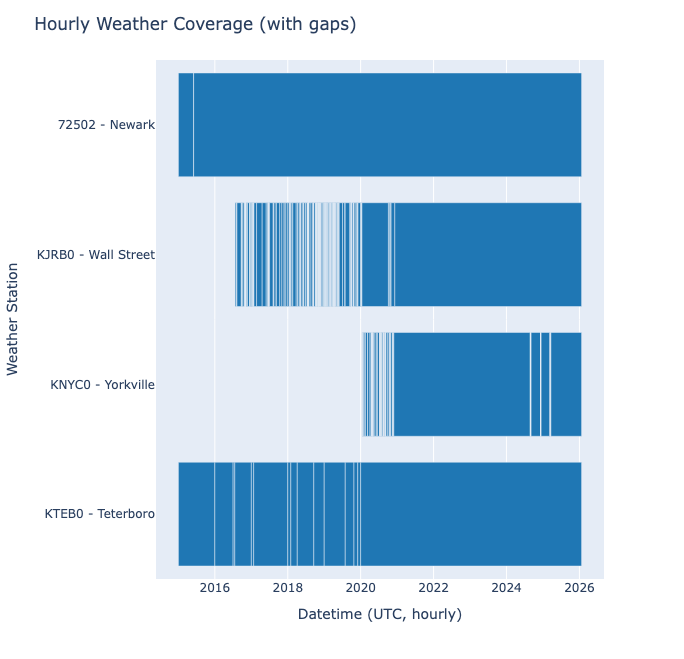
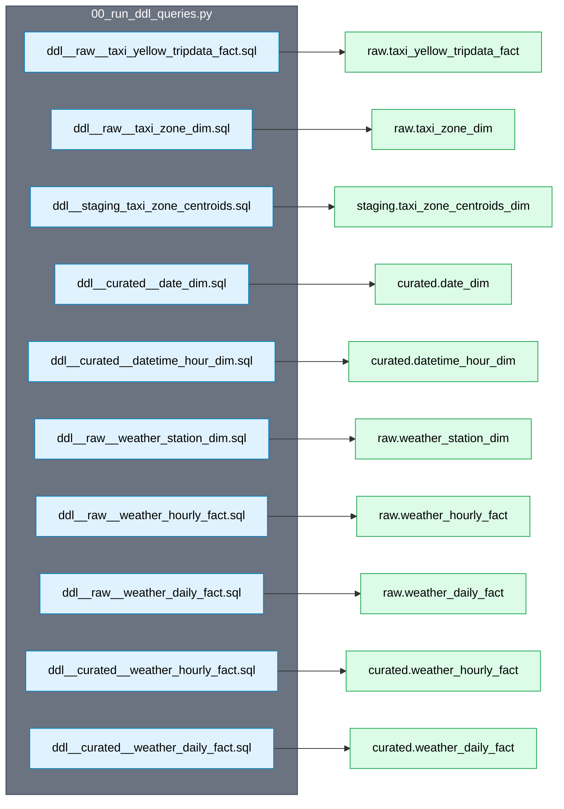
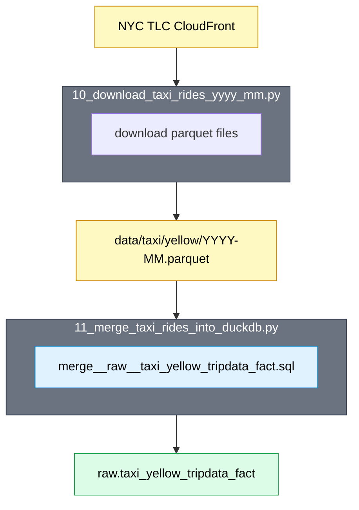
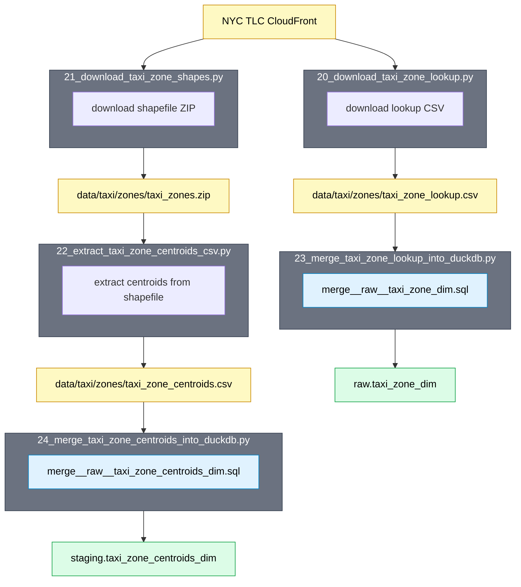
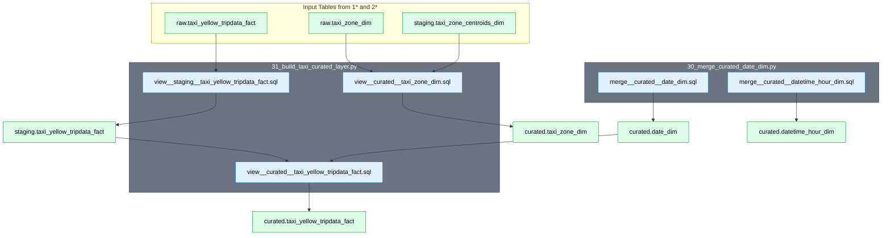
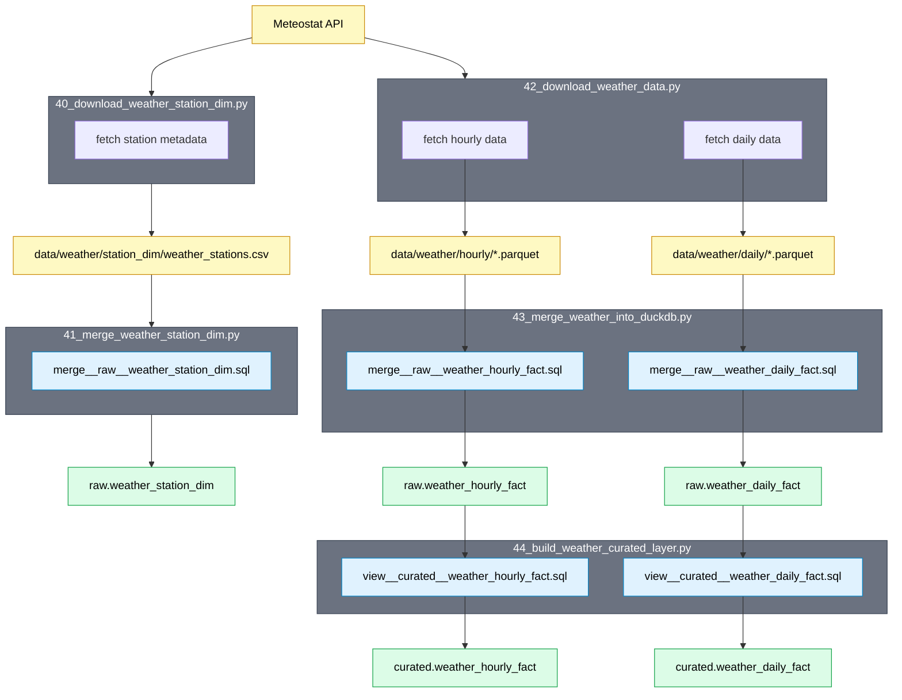

# Local ML Pipeline

The goal of this `local/` directory is to eliminate any need of infrastructure and get the whole project running locally.

I (Eric) found myself confounded by two simultaneous learning curves: sagemaker and timeseries forecasting in general.

Running everything locally, and without an orchestrating framework like Airflow, Metaflow, SageMaker, etc. will make the infra part much more straightforward.

Note: 
- an ML system has a rigidly defined output. No matter what experimental approaches you take, they are only valid if the output is in the correct format. E.g. a series of predictions on the grain `pu_location`-`date`.
- but an experiment can infinitely vary the inputs.

## Overview

1. Download taxi ride + zone + weather data idempotently

    ```bash
    just download-taxi-data \
        --year-month-start=2025-01 \
        --year-month-end-inclusive=2025-12

    just download-taxi-zone-dimension

    # Weather data from 4 Meteostat stations near Manhattan
    just download-weather-station-dimension
    just download-weather-data --start-date=2015-01-01 --end-date=2025-12-31
    ```

    - skips already downloaded files (use `--force` to overwrite)
    - taxi data defaults to last 3 months, acknowledging that the NYC TLC publishes data with a 2-month delay
    - weather stations: KNYC0 (Yorkville), KTEB0 (Teterboro), KJRB0 (Wall Street), 72502 (Newark). We would have taken the closest weather station to Central Park only, but not all stations have data going back to 2015, so we took the 4 closest stations and coalesce them (roughly) in order of closest to furthest from central part. 

    

    TODO: we should use the `meteostat` `interpolate()` function to give a weighted average of the 4 stations. This is better than coalesce, because coalesce essentially jumps all over the map.

2. Load into DuckDB and build curated layer

    ```bash
    just run-ddl-queries

    just merge-taxi-data \
        --year-month-start=2025-01 \
        --year-month-end-inclusive=2025-12

    just merge-taxi-zone-dimension

    just merge-curated-date-dim \
        --start-date=2025-01-01 \
        --end-date=2025-12-31

    just build-taxi-curated-layer \
        --year-month-start=2025-01 \
        --year-month-end-inclusive=2025-12

    # Weather: merge raw then build curated with priority-based coalescing
    just merge-weather-station-dimension
    just merge-weather-data --start-date=2015-01-01 --end-date=2025-12-31
    just build-weather-curated-layer
    ```

    | pickup_taxi_zone_id | pickup_date | number_ride_pickups | ... |
    | --- | --- | --- | --- |
    | 4 | 2025-01-01 | 269 | ... |
    | 4 | 2025-01-02 | 52 | ... |
    | 4 | 2025-01-03 | 88 | ... |

    - runs SQL queries parameterized by date against data in these files, uses merge into for idempotency
    - defaults to most recent 3 months, currently in the lakehouse.duckdb
    - curated weather tables coalesce 4 stations into one row per timestamp

**Consideration:** Weather forecast data is not the same as realized weather data.

1. When you are at a date D and you get a weather forecast for D + 1, D + 2, etc., there is uncertainty about how accurate that forecast will actually be. In other words, a forecasted temperature or humidity or wind speed or Air Quality Index reading will have some amount of error (residuals) compared to what it actually ends up being.
2. Realized historical weather data is just correct. It was what it was (except for measurement error in instruments). So, when training a model, there is a difference between using realized weather data and forecasted weather data.

How should we handle this? If nothing else, communicate that using "historical weather data" is cheating, because it is essentially being able to see the future. In other words, it is "future data leakage". Maybe we just accept this and say that in a real world scenario, it is ideal to have a backfilled historical dataset of what the weather FORECAST was on a date, not what the ACTUAL weather would be.

3. Train model

    ```bash
    just train-model \
        --run-id=1 \
        --holdout-year-month-start=2025-10 \
        --train-year-month-start=2025-01
    ```

    - trains model on the training data
    - cross validation goes here

4. Evaluate model

    ```bash
    just evaluate-model \
        --run-id=1 \
        --holdout-year-month-start=2025-10 \
        --holdout-year-month-end=2025-11
    ```

    - loads model from the run ID
    - evaluates model on the holdout data IN AN ALGORITHM AGNOSTIC WAY
      - case 1: model is recursive
      - case 2: model is not recursive
    - creates visualizations
      - prediction intervals
      - actual vs. forecast
      - bias and variation
    - logs RMSE

    [Reddit thread](https://www.reddit.com/r/learnmachinelearning/comments/xs2ish/why_on_earth_do_most_online_examples_show_cross/) on when to use cross-validation vs use a holdout set.

5. Deploy model

  > Question: Which deployment paradigm should we use?

  Options:
  1. train once, e.g. every 7 days, and forecast daily
  2. retrain daily and immediately forecast

  One preference: never transiiton a model from "non-prod" to "prod". Always re-train the model in prod once the code is merged.

## Data Lineage

*To update or generate these diagrams, use the prompt hidden at this point as a comment in the raw README.md*

<!--

PROMPT FOR GENERATING DATA LINEAGE DIAGRAMS

Use this prompt with an AI assistant to generate or update data lineage diagrams for this project.

## Definitions

- **Data Assets**: SQL tables, files, external data APIs (databases, Meteostat API, etc.)
- **Jobs**: Python scripts, SQL queries

## Style Guide

### Flowchart Direction

- Use `flowchart TD` (top-down) for most diagrams
- Use `flowchart LR` (left-right) only when showing many parallel DDL-to-table mappings

### Jobs

- Jobs should be an outer box (subgraph)
- If a Python script job invokes a SQL script, put the SQL script inside the outer box
- Use the exact, full name of the script in the title of the outer box
- Use the exact, full name of the SQL query file in the inner box

### Data Assets

- Show the file path if it is a file
- Use a glob expression or placeholder like YYYY-MM if it is a set of files

### Color Scheme (classDef)

Always include these class definitions at the top of each diagram:

```
classDef job fill:#6b7280,stroke:#374151,color:#fff
classDef sql fill:#e0f2fe,stroke:#0284c7,color:#000
classDef file fill:#fef9c3,stroke:#ca8a04,color:#000
classDef table fill:#dcfce7,stroke:#16a34a,color:#000
```

- **Jobs** (gray with white text): Python script outer boxes
- **SQL queries** (light blue): SQL query files invoked by scripts
- **Files/APIs** (yellow): Files, external databases, and external Data APIs
- **Tables** (green): SQL database tables (raw.*, staging.*, curated.*)

### Structure

1. **Data Sources**: External APIs or services (e.g., "NYC TLC CloudFront", "Meteostat API") - use `:::file` class (yellow)
2. **Script Boxes**: Subgraph with exact script filename as title
3. **SQL Files**: Inside subgraph, show exact SQL filename with `:::sql` class
4. **File Artifacts**: Show intermediate files with full paths (e.g., `data/taxi/yellow/YYYY-MM.parquet`)
5. **Tables**: Show final database tables with schema prefix (e.g., `raw.taxi_zone_dim`)

### Node Naming

- Use descriptive IDs: `script_10`, `lookup_csv`, `raw_zone`
- Apply class with `:::job`, `:::sql`, `:::file`, or `:::table`

### Flow

- Arrows show data flow: source → script → file → script → table
- Keep flows top-to-bottom or left-to-right consistently within a diagram

## Example

Use arrows (double-hyphen greater-than) to connect nodes:

    API[External API]:::file
    subgraph script_name [download_script.py]
        sql[merge__table.sql]:::sql
    end
    file[data/folder/file.parquet]:::file
    table[raw.table_name]:::table

    API (arrow) script_name (arrow) file (arrow) table

-->

### 0* Scripts - DDL (Schema Creation)



### 1* Scripts - Taxi Rides



### 2* Scripts - Taxi Zone Dimension



### 3* Scripts - Taxi Curated Layer



### 4* Scripts - Weather Data



### Complete Data Lineage

```mermaid
flowchart TD
    classDef sql fill:#e0f2fe,stroke:#0284c7,color:#000
    classDef file fill:#fef9c3,stroke:#ca8a04,color:#000
    classDef table fill:#dcfce7,stroke:#16a34a,color:#000

    %% External APIs
    subgraph apis [External Data Sources]
        direction LR
        tlc_api[NYC TLC CloudFront]:::file
        meteostat_api[Meteostat API]:::file
    end

    %% 1* Taxi Rides Flow
    subgraph script_10 [10_download_taxi_rides_yyyy_mm.py]
        download_10[download parquet files]
    end
    taxi_parquet[data/taxi/yellow/YYYY-MM.parquet]:::file
    subgraph script_11 [11_merge_taxi_rides_into_duckdb.py]
        merge_11[merge__raw__taxi_yellow_tripdata_fact.sql]:::sql
    end
    raw_taxi[raw.taxi_yellow_tripdata_fact]:::table

    %% 2* Taxi Zone Flow - Lookup
    subgraph script_20 [20_download_taxi_zone_lookup.py]
        download_20[download lookup CSV]
    end
    lookup_csv[data/taxi/zones/taxi_zone_lookup.csv]:::file
    subgraph script_23 [23_merge_taxi_zone_lookup_into_duckdb.py]
        merge_23[merge__raw__taxi_zone_dim.sql]:::sql
    end
    raw_zone[raw.taxi_zone_dim]:::table

    %% 2* Taxi Zone Flow - Shapes/Centroids
    subgraph script_21 [21_download_taxi_zone_shapes.py]
        download_21[download shapefile ZIP]
    end
    shapes_zip[data/taxi/zones/taxi_zones.zip]:::file
    subgraph script_22 [22_extract_taxi_zone_centroids_csv.py]
        extract_22[extract centroids from shapefile]
    end
    centroids_csv[data/taxi/zones/taxi_zone_centroids.csv]:::file
    subgraph script_24 [24_merge_taxi_zone_centroids_into_duckdb.py]
        merge_24[merge__raw__taxi_zone_centroids_dim.sql]:::sql
    end
    stg_centroid[staging.taxi_zone_centroids_dim]:::table

    %% 3* Date Dimension Flow
    subgraph script_30 [30_merge_curated_date_dim.py]
        merge_date[merge__curated__date_dim.sql]:::sql
        merge_datetime[merge__curated__datetime_hour_dim.sql]:::sql
    end
    cur_date[curated.date_dim]:::table
    cur_datetime[curated.datetime_hour_dim]:::table

    %% 3* Taxi Curated Layer
    subgraph script_31 [31_build_taxi_curated_layer.py]
        view_stg[view__staging__taxi_yellow_tripdata_fact.sql]:::sql
        view_zone[view__curated__taxi_zone_dim.sql]:::sql
        view_fact[view__curated__taxi_yellow_tripdata_fact.sql]:::sql
    end
    stg_taxi[staging.taxi_yellow_tripdata_fact]:::table
    cur_zone[curated.taxi_zone_dim]:::table
    cur_fact[curated.taxi_yellow_tripdata_fact]:::table

    %% 4* Weather Station Flow
    subgraph script_40 [40_download_weather_station_dim.py]
        download_40[fetch station metadata]
    end
    station_csv[data/weather/station_dim/weather_stations.csv]:::file
    subgraph script_41 [41_merge_weather_station_dim.py]
        merge_41[merge__raw__weather_station_dim.sql]:::sql
    end
    raw_station[raw.weather_station_dim]:::table

    %% 4* Weather Data Flow
    subgraph script_42 [42_download_weather_data.py]
        download_42_hourly[fetch hourly data]
        download_42_daily[fetch daily data]
    end
    hourly_pq[data/weather/hourly/*.parquet]:::file
    daily_pq[data/weather/daily/*.parquet]:::file
    subgraph script_43 [43_merge_weather_into_duckdb.py]
        merge_43_hourly[merge__raw__weather_hourly_fact.sql]:::sql
        merge_43_daily[merge__raw__weather_daily_fact.sql]:::sql
    end
    raw_hourly[raw.weather_hourly_fact]:::table
    raw_daily[raw.weather_daily_fact]:::table

    %% 4* Weather Curated Layer
    subgraph script_44 [44_build_weather_curated_layer.py]
        view_hourly[view__curated__weather_hourly_fact.sql]:::sql
        view_daily[view__curated__weather_daily_fact.sql]:::sql
    end
    cur_hourly[curated.weather_hourly_fact]:::table
    cur_daily[curated.weather_daily_fact]:::table

    %% Connections - 1* Taxi Rides
    tlc_api --> script_10 --> taxi_parquet --> script_11 --> raw_taxi

    %% Connections - 2* Taxi Zones
    tlc_api --> script_20 --> lookup_csv --> script_23 --> raw_zone
    tlc_api --> script_21 --> shapes_zip --> script_22 --> centroids_csv --> script_24 --> stg_centroid

    %% Connections - 3* Date Dimensions
    merge_date --> cur_date
    merge_datetime --> cur_datetime

    %% Connections - 3* Taxi Curated
    raw_taxi --> view_stg --> stg_taxi
    raw_zone --> view_zone
    stg_centroid --> view_zone
    view_zone --> cur_zone
    stg_taxi --> view_fact
    cur_date --> view_fact
    view_fact --> cur_fact

    %% Connections - 4* Weather
    meteostat_api --> script_40 --> station_csv --> script_41 --> raw_station
    meteostat_api --> script_42
    download_42_hourly --> hourly_pq
    download_42_daily --> daily_pq
    hourly_pq --> merge_43_hourly --> raw_hourly --> view_hourly --> cur_hourly
    daily_pq --> merge_43_daily --> raw_daily --> view_daily --> cur_daily

    %% Style all script subgraphs
    style script_10 fill:#6b7280,stroke:#374151,color:#fff
    style script_11 fill:#6b7280,stroke:#374151,color:#fff
    style script_20 fill:#6b7280,stroke:#374151,color:#fff
    style script_21 fill:#6b7280,stroke:#374151,color:#fff
    style script_22 fill:#6b7280,stroke:#374151,color:#fff
    style script_23 fill:#6b7280,stroke:#374151,color:#fff
    style script_24 fill:#6b7280,stroke:#374151,color:#fff
    style script_30 fill:#6b7280,stroke:#374151,color:#fff
    style script_31 fill:#6b7280,stroke:#374151,color:#fff
    style script_40 fill:#6b7280,stroke:#374151,color:#fff
    style script_41 fill:#6b7280,stroke:#374151,color:#fff
    style script_42 fill:#6b7280,stroke:#374151,color:#fff
    style script_43 fill:#6b7280,stroke:#374151,color:#fff
    style script_44 fill:#6b7280,stroke:#374151,color:#fff
```



## Local Folder Structure

```
local/
  scripts/
    00_run_ddl_queries.py - run all ddl__*.sql files
    10_download_taxi_rides_yyyy_mm.py - download monthly yellow taxi parquet files
    11_merge_taxi_rides_into_duckdb.py - merge taxi ride parquet files into raw table
    20_download_taxi_zone_lookup.py - download TLC taxi zone lookup CSV
    21_download_taxi_zone_shapes.py - download TLC taxi zone shapefile ZIP
    22_extract_taxi_zone_centroids_csv.py - extract centroids CSV from shapefile ZIP
    23_merge_taxi_zone_lookup_into_duckdb.py - merge taxi zone lookup CSV into raw table
    24_merge_taxi_zone_centroids_into_duckdb.py - merge centroid rows into staging table
    30_merge_curated_date_dim.py - merge curated.date_dim for a date range
    31_build_taxi_curated_layer.py - build staged and curated taxi tables
    40_download_weather_station_dim.py - download weather station metadata from Meteostat
    41_merge_weather_station_dim.py - merge weather station dim into DuckDB
    42_download_weather_data.py - download hourly + daily weather data from Meteostat
    43_merge_weather_into_duckdb.py - merge weather parquet into raw tables
    44_build_weather_curated_layer.py - build curated weather tables with coalesce
  queries/
    ddl__raw__taxi_yellow_tripdata_fact.sql - raw yellow taxi trips table DDL
    merge__raw__taxi_yellow_tripdata_fact.sql - merge raw taxi rides from parquet files
    view__staging__taxi_yellow_tripdata_fact.sql - staging table built from raw rides
    view__curated__taxi_yellow_tripdata_fact.sql - curated taxi rides table
    ddl__raw__taxi_zone_dim.sql - raw taxi zone dimension DDL
    merge__raw__taxi_zone_dim.sql - merge taxi zone lookup CSV into raw dim
    ddl__staging_taxi_zone_centroids.sql - staging centroids dimension DDL
    merge__raw__taxi_zone_centroids_dim.sql - merge computed centroids into staging
    view__curated__taxi_zone_dim.sql - curated taxi zone dimension table
    ddl__curated__date_dim.sql - curated date dimension DDL
    merge__curated__date_dim.sql - merge date dimension for a date range
    ddl__curated__datetime_hour_dim.sql - curated hour dimension DDL
    merge__curated__datetime_hour_dim.sql - merge datetime hour dimension for a date range
    ddl__raw__weather_station_dim.sql - raw weather station dimension DDL
    ddl__raw__weather_daily_fact.sql - raw daily weather fact DDL
    ddl__raw__weather_hourly_fact.sql - raw hourly weather fact DDL
    ddl__curated__weather_daily_fact.sql - curated daily weather fact DDL
    ddl__curated__weather_hourly_fact.sql - curated hourly weather fact DDL
    merge__raw__weather_station_dim.sql - merge weather station CSV into raw dim
    merge__raw__weather_daily_fact.sql - merge daily weather parquet into raw
    merge__raw__weather_hourly_fact.sql - merge hourly weather parquet into raw
    view__curated__weather_daily_fact.sql - curated daily weather with coalesce
    view__curated__weather_hourly_fact.sql - curated hourly weather with coalesce
    initial_daily_taxi_rides.sql - daily pickup series per zone for modeling
```